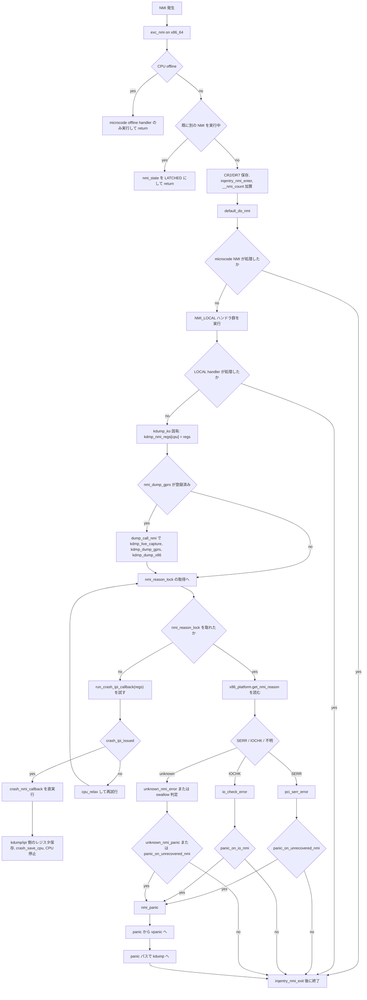
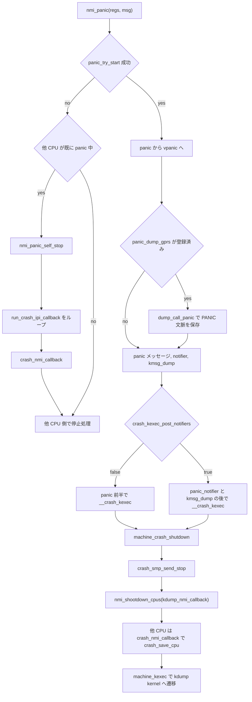
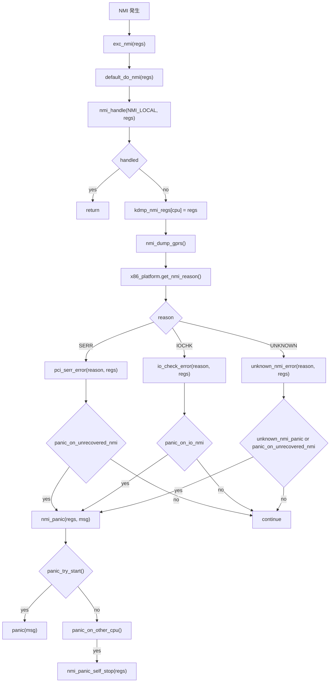
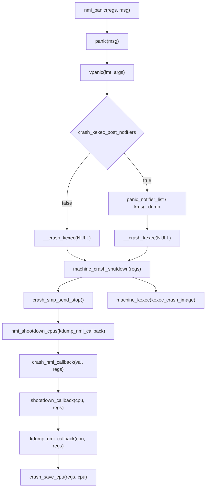
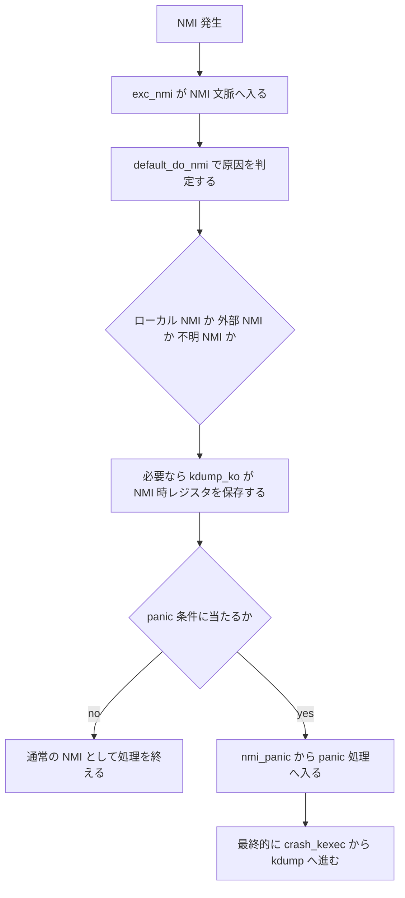
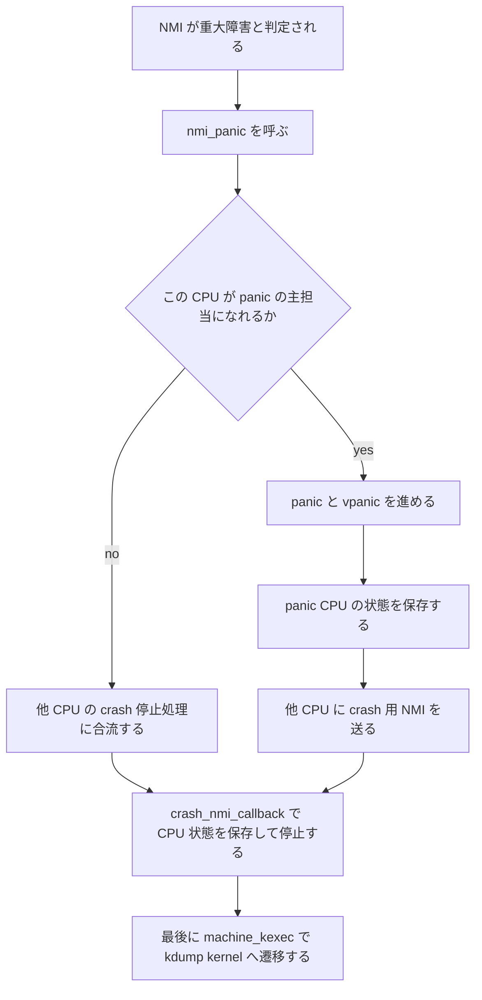
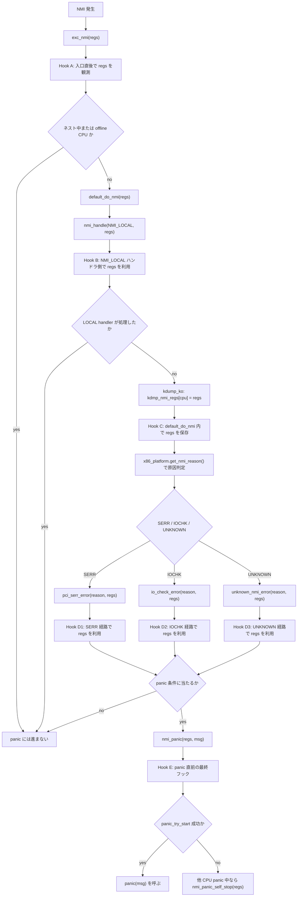

# x86_64 における NMI ハンドラの処理

この文書は `linux-yocto_kdump_ko` の x86_64 向け NMI 処理を、`arch/x86/kernel/nmi.c` の `exc_nmi()` と `default_do_nmi()` を起点に整理したものです。

このツリーでは `CONFIG_CUSTOM_CRASHCUMP` により、NMI 中に `kdmp_nmi_regs[cpu] = regs` と `nmi_dump_gprs()` が追加されており、NMI 文脈のレジスタを `kdmp` 領域へ保存できます。

## 1. 全体フロー



## 2. panic から kdump へ落ちる流れ

`nmi_panic()` は NMI 文脈専用の panic 入口です。

- `panic_try_start()` に成功した CPU は `panic()` に進む
- 既に他 CPU が panic 中なら `nmi_panic_self_stop()` に入り、`run_crash_ipi_callback()` を回し続ける
- x86_64 では `run_crash_ipi_callback()` が `crash_ipi_issued` を見て `crash_nmi_callback()` を直接呼べるため、NMI 文脈にいる CPU でも crash stop に参加できる



## 2.2. 関数コールツリーベースのフローチャート

制御の意味よりも、「どの関数が次にどの関数を呼ぶか」を追いやすくした図です。

### 2.2.1 NMI 発生から panic 呼び出しまで



### 2.2.2 panic から kdump まで



### 2.2.3 Hook C を軸に見た呼び出し位置

今回の用途に引き寄せると、`Hook C` は次の call chain の途中にあります。

```text
exc_nmi(regs)
  -> default_do_nmi(regs)
    -> nmi_handle(NMI_LOCAL, regs)
    -> [Hook C] kdmp_nmi_regs[cpu] = regs
    -> x86_platform.get_nmi_reason()
      -> pci_serr_error(reason, regs)
      -> io_check_error(reason, regs)
      -> unknown_nmi_error(reason, regs)
        -> nmi_panic(regs, msg)
          -> panic(msg)
```

このため、`Hook C` を使うと `SERR`、`IOCHK`、`UNKNOWN` の 3 経路に分かれる前に、共通の `regs` を 1 回だけ押さえられます。

## 2.5. 説明用の簡易フローチャート

詳細図は上の 2 つを参照してください。ここでは説明しやすさを優先して、x86_64 の NMI 処理を大まかな 2 段階に潰しています。

### 2.5.1 NMI ハンドラの簡易図



### 2.5.2 panic 連携の簡易図



この簡易図として見ると、要点は次の 3 つです。

- NMI 入口は `exc_nmi()` だが、実際の判定の中心は `default_do_nmi()` にある
- `linux-yocto_kdump_ko` では NMI 中にも `kdmp_nmi_regs` と `nmi_dump_gprs()` で情報を拾う
- panic 条件に入ると、主担当 CPU が `panic()` を進め、他 CPU は crash NMI 側で状態保存して停止する

## 2.6. NMI 発生から panic 呼び出しまでに絞ったフローと pt_regs フック候補

`kdump` 遷移以降は省いて、`NMI 発生` から `nmi_panic()` が `panic()` を呼ぶところまでに限定した図です。



### フック候補の見方

- Hook A: `exc_nmi(regs)` の入口。最も早い観測点だが、まだ原因分類前でネスト制御の影響も受ける
- Hook B: `nmi_handle(NMI_LOCAL, regs)` に登録する方式。perf watchdog や local APIC 系の NMI を個別に拾いたい場合に向く
- Hook C: `default_do_nmi()` の `NMI_LOCAL` 未処理直後。今の `kdump_ko` が実際に `kdmp_nmi_regs[cpu] = regs` を入れている場所
- Hook D1/D2/D3: `pci_serr_error()`、`io_check_error()`、`unknown_nmi_error()`。panic に至る直前の原因別フックを入れたい場合に向く
- Hook E: `nmi_panic(regs, msg)` の直前または内部。panic 呼び出し前に必ず 1 回だけ共通処理したい場合の最終候補

実装上は、共通の `pt_regs` スナップショットを取りたいなら Hook C または Hook E、原因別に追加情報を混ぜたいなら Hook D1/D2/D3 が分かりやすいです。

### 各フックポイントのメリットとデメリット

#### Hook A: `exc_nmi(regs)` の入口直後

- メリット: 最も早い地点で `regs` を観測できるため、後続処理で `regs` がどう使われるかに依存しない
- メリット: `default_do_nmi()` に入る前なので、NMI_LOCAL や原因判定に関係なく共通処理を差し込みやすい
- デメリット: まだ原因未判定で、`LOCAL`、`SERR`、`IOCHK`、`UNKNOWN` の区別が付かない
- デメリット: NMI 入口そのものなので制約が最も厳しく、重い処理や複雑な分岐を足す場所としては危険
- デメリット: nested NMI や `offline CPU` の分岐をまたぐため、ここでのフック結果だけでは「panic へ向かう NMI」かどうか確定しない

#### Hook B: `nmi_handle(NMI_LOCAL, regs)` 側

- メリット: CPU ローカルな NMI ハンドラ連鎖に自然に乗れるため、watchdog や perf 系の local NMI を狙って処理を追加しやすい
- メリット: `register_nmi_handler()` ベースで入れられるなら、既存構造に合わせた拡張になりやすい
- デメリット: `NMI_LOCAL` 専用なので、`SERR` や `IOCHK`、純粋な unknown NMI にはそのまま効かない
- デメリット: 既存ハンドラが先に `handled` を返す構成だと、期待する順序で観測できないことがある
- デメリット: panic に行く外部 NMI 全体を 1 箇所で拾いたい用途には向かない

#### Hook C: `default_do_nmi()` の `NMI_LOCAL` 未処理直後

- メリット: 今の `kdump_ko` が実際に使っている位置で、導入実績があり意味づけが明確
- メリット: `NMI_LOCAL` で処理済みのケースを除外したあとに共通で `regs` を保存できるため、ノイズが減る
- メリット: 原因判定前なので、後続の `SERR`、`IOCHK`、`UNKNOWN` へ進む候補を幅広く拾える
- デメリット: ここでもまだ原因種別は未確定なので、原因別メタデータを付けたい場合は追加判定が必要
- デメリット: `NMI_LOCAL` で処理された NMI はここに来ないため、「すべての NMI」を対象にはできない
- デメリット: `nmi_reason_lock` より前なので、panic 進行中の crash IPI 競合と混ざる可能性を考慮する必要がある

#### Hook D1: `pci_serr_error(reason, regs)`

- メリット: `SERR` が確定した後なので、原因別の専用採取やログ付与がしやすい
- メリット: panic 条件の直前に近く、`panic_on_unrecovered_nmi` を見る前後で制御しやすい
- デメリット: `SERR` 専用であり、他の NMI 原因には使い回せない
- デメリット: 原因別フックを増やすと、同じ採取処理が `D1/D2/D3` に分散しやすい

#### Hook D2: `io_check_error(reason, regs)`

- メリット: `IOCHK` 専用の panic 条件 `panic_on_io_nmi` に直結しているため、panic 前観測点として分かりやすい
- メリット: 既に `show_regs(regs)` がある流れなので、`regs` を使う処理との親和性が高い
- デメリット: `IOCHK` 以外を拾えない
- デメリット: panic しない分岐では待ちループや再有効化処理もあり、そこに副作用を入れると挙動を読みづらくしやすい

#### Hook D3: `unknown_nmi_error(reason, regs)`

- メリット: `NMI_UNKNOWN` ハンドラ群でも処理されなかった、最後の unknown NMI を拾える
- メリット: `unknown_nmi_panic` や `panic_on_unrecovered_nmi` に落ちる直前を狙える
- デメリット: ここに来る時点で「他の既知原因ではなかった」ことしか分からず、原因情報は弱い
- デメリット: unknown NMI はノイズや取りこぼしの影響も受けやすく、確定イベントとして扱いにくい

#### Hook E: `nmi_panic(regs, msg)` の直前または内部

- メリット: `panic` を呼ぶ直前の共通地点なので、最終的に panic に向かうケースだけを 1 箇所で拾える
- メリット: `regs` と `msg` の両方を見ながら、panic 理由とレジスタを対で扱える
- メリット: `SERR`、`IOCHK`、`UNKNOWN` の個別分岐で重複実装せずに済む
- デメリット: ここまで来ると `NMI_LOCAL` で処理済みだったケースや、panic しない NMI は完全に見えない
- デメリット: `panic_try_start()` 後は panic 競合制御に入るため、追加処理はより短く、失敗しにくいものに限るべき
- デメリット: すでに「panic する」と決まった後なので、原因別の細かな前処理を差し込む柔軟性は低い

### 使い分けの目安

- 「まず `regs` を必ず早く取っておきたい」なら Hook A
- 「local NMI 系イベントだけを拡張したい」なら Hook B
- 「今の `kdump_ko` と同じ文脈で、panic 前の広い範囲を拾いたい」なら Hook C
- 「原因別に採取内容を変えたい」なら Hook D1/D2/D3
- 「panic に行くケースだけを共通に 1 回処理したい」なら Hook E

## 3. このツリーでの `kdump_ko` 固有ポイント

- `default_do_nmi()` の `NMI_LOCAL` 未処理後に、`kdmp_nmi_regs[cpu] = regs` が実行される
- `nmi_dump_gprs` が `kdmp_setup.c` で `dump_call_nmi` に接続される
- `dump_call_nmi()` は `kdmp_live_capture(..., KDMP_EVENT_NMI, ...)`、`kdmp_dump_gprs(KDMP_NMI)`、`kdmp_dump_x86(KDMP_NMI)` を呼ぶ
- panic 側では `panic_dump_gprs` が `dump_call_panic` に接続され、panic CPU の文脈も別枠で保存される
- このツリーの `kernel/panic.c` では `crash_kexec_post_notifiers = IS_ENABLED(CONFIG_CUSTOM_CRASHCUMP) && IS_ENABLED(CONFIG_KEXEC)` なので、通常は panic notifier 実行後に `__crash_kexec()` へ進む

## 4. コード上の対応箇所

- NMI 入口: `arch/x86/kernel/nmi.c::exc_nmi()`
- NMI 本体: `arch/x86/kernel/nmi.c::default_do_nmi()`
- panic 入口: `kernel/panic.c::nmi_panic()`
- crash IPI の直実行: `arch/x86/kernel/reboot.c::run_crash_ipi_callback()`
- 他 CPU 停止用 NMI: `arch/x86/kernel/reboot.c::crash_nmi_callback()`
- kdump 側 CPU 状態保存: `arch/x86/kernel/crash.c::kdump_nmi_callback()`
- `kdump_ko` の NMI レジスタ保存: `arch/x86/kdmp/kdmp_setup.c`, `arch/x86/kdmp/kdmp_dump.c`

## 5. 補足

- x86_64 でも FRED 有効時は入口が `DEFINE_FREDENTRY_NMI(exc_nmi)` 側になりますが、最終的な本体処理は同じく `default_do_nmi()` です
- back-to-back NMI の場合は `swallow_nmi` と `last_nmi_rip` を使って一部 NMI を吸収し、重複処理を避けます
- `nmi_reason_lock` を取れないケースは「他 CPU が crash dump 準備中」の可能性があるため、単なる待ちではなく `run_crash_ipi_callback()` を挟むのが重要です

## 6. 現状ソースで登録され得る NMI ハンドラ

`arch/x86/include/asm/nmi.h` では NMI は `NMI_LOCAL`、`NMI_UNKNOWN`、`NMI_SERR`、`NMI_IO_CHECK` に分類されます。

このツリーの x86_64 側では、少なくとも次の登録コードがあります。

### 6.1 `NMI_LOCAL`

- `PMI`: `arch/x86/events/core.c` の `perf_event_nmi_handler`
- `perf_ibs`: `arch/x86/events/amd/ibs.c` の `perf_ibs_nmi_handler`
- `arch_bt`: `arch/x86/kernel/apic/hw_nmi.c` の `nmi_cpu_backtrace_handler`
- `smp_stop_nmi_callback`: `arch/x86/kernel/smp.c`
- `kgdb`: `arch/x86/kernel/kgdb.c` の `kgdb_nmi_handler`
- `ghes`: `drivers/acpi/apei/ghes.c` の `ghes_notify_nmi`
- emergency handler: panic/crash 中は `arch/x86/kernel/reboot.c` の `crash_nmi_callback`

### 6.2 `NMI_SERR`

- `ecclog_nmi_handler`: `drivers/edac/igen6_edac.c`
- `hpwdt_pretimeout`: `drivers/watchdog/hpwdt.c`

### 6.3 `NMI_IO_CHECK`

- `hpwdt_pretimeout`: `drivers/watchdog/hpwdt.c`

### 6.4 `NMI_UNKNOWN`

- `hv_nmi_unknown`: `arch/x86/kernel/cpu/mshyperv.c`
- `kgdb_nmi_handler`: `arch/x86/kernel/kgdb.c`
- `ipmi_nmi`: `drivers/char/ipmi/ipmi_watchdog.c`
- `hpwdt_pretimeout`: `drivers/watchdog/hpwdt.c`
- `uv_handle_nmi`: `arch/x86/platform/uv/uv_nmi.c`

### 6.5 現在の `.config` から見た有力候補

- `CONFIG_PERF_EVENTS=y` なので `NMI_LOCAL` の `PMI` は有力
- `arch_bt` は early init 登録なので有力
- `CONFIG_KGDB=y` なので `kgdb` は登録され得る
- `CONFIG_EDAC_IGEN6=y` なので、条件が合えば `NMI_SERR` の `ecclog_nmi_handler` は有力
- `Hyper-V`、`hpwdt`、`ipmi_watchdog`、`ghes` はビルド条件や実機条件次第で、この文書執筆時点では常時有効とまでは断定しない

## 7. 今回の方針整理

今回の要件は「外部 PCI watchdog デバイス由来の `NMI SERR`、および `IOCHK`、`Unknown` をパラメータで panic させたい」であり、`NMI_LOCAL` は対象ではありません。

この前提では、`Hook C` で `pt_regs` を先に共通退避し、その後 `pci_serr_error()`、`io_check_error()`、`unknown_nmi_error()` の各経路で原因だけ確定させる構成が扱いやすいです。

- `Hook C` は `NMI_LOCAL` 未処理後に走るため、`SERR`、`IOCHK`、`Unknown` に進むケースを 1 箇所で拾える
- `SERR` 専用に見るなら `Hook D1` が最も素直だが、`IOCHK` と `Unknown` も含めて共通に `regs` を扱いたいなら `Hook C` のほうが整理しやすい
- したがって、`regs` 取得は `Hook C`、原因確定は `D1/D2/D3` の二段構えが今回の要件に最も合う
