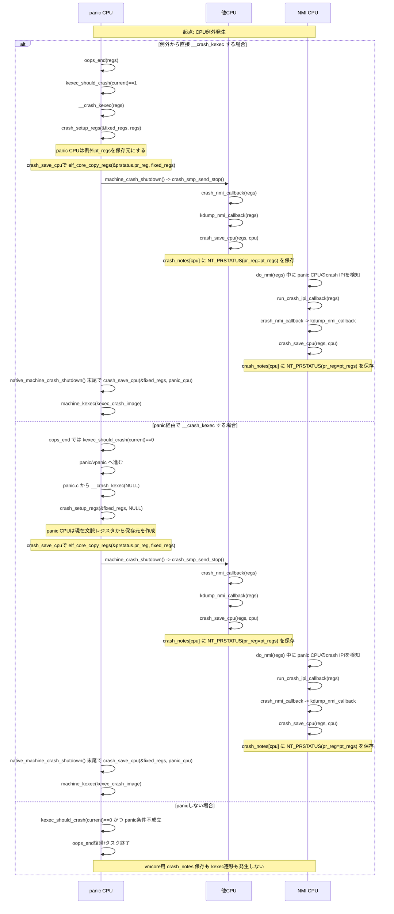

# CPU例外時のレジスタ取得タイミング

## 1) カスタム追加ダンプ (CONFIG_CUSTOM_CRASHCUMP)

```mermaid
sequenceDiagram
    participant PC as panic CPU
    participant OC as 他CPU
    participant NC as NMI CPU

    Note over PC,NC: 起点: CPU例外発生
    PC->>PC: __die_body(regs) で kdmp_ecxt_regs[cpu] = regs
    Note over PC: ここでは pt_regs ポインタ保存のみ (実体コピーなし)

    alt kexec_should_crash=1
        alt crash_kexec_post_notifiers=0
            PC->>PC: oops_end で crash_kexec(regs)
            PC->>PC: __crash_kexec(regs) に即時遷移
            Note over PC: panic/vpanic を経由しないため panic_dump_gprs は未実行
            Note over PC: panic CPUの custom status[panic] へのGPR保存処理は走らない

            PC->>OC: machine_crash_shutdown -> crash_smp_send_stop
            OC->>OC: crash_nmi_callback(regs)
            OC->>OC: kdmp_ipi_regs[cpu] = regs
            OC->>OC: ipi_dump_gprs() -> kdmp_dump_gprs/x86(KDMP_IPI)
            Note over OC: kdmp_dump_gprs: inline asmでGPR読取 -> status[IPI].x86_regs.gprs/saved_sp
            Note over OC: kdmp_dump_x86: memcpy(*kdmp_ipi_regs)->excp_gprs + CR/DR/MMX/XMM/MSR/kstack

            NC->>NC: do_nmi(regs) (外部NMI/WD)
            NC->>NC: kdmp_nmi_regs[cpu] = regs
            NC->>NC: nmi_dump_gprs() -> kdmp_dump_gprs/x86(KDMP_NMI)
            Note over NC: kdmp_dump_gprs: inline asmでGPR読取 -> status[NMI].x86_regs.gprs/saved_sp
            Note over NC: kdmp_dump_x86: memcpy(*kdmp_nmi_regs)->excp_gprs + CR/DR/MMX/XMM/MSR/kstack
        else crash_kexec_post_notifiers=1
            PC->>PC: oops_end では __crash_kexec せず panic/vpanic へ
            PC->>PC: panic_dump_gprs() -> dump_call_panic()
            PC->>PC: kdmp_dump_gprs(KDMP_PANIC)
            PC->>PC: kdmp_dump_x86(KDMP_PANIC)
            Note over PC: kdmp_dump_gprs: inline asmでGPR読取 -> status[PANIC].x86_regs.gprs/saved_sp
            Note over PC: kdmp_dump_x86: memcpy(*kdmp_ecxt_regs)->excp_gprs + CR/DR/MMX/XMM/MSR/kstack

            PC->>OC: crash_smp_send_stop() で crash NMI送信
            OC->>OC: crash_nmi_callback(regs)
            OC->>OC: kdmp_ipi_regs[cpu] = regs
            OC->>OC: ipi_dump_gprs() -> kdmp_dump_gprs/x86(KDMP_IPI)
            Note over OC: status[IPI] に gprs/excp_gprs を保存

            NC->>NC: do_nmi(regs) (外部NMI/WD)
            NC->>NC: kdmp_nmi_regs[cpu] = regs
            NC->>NC: nmi_dump_gprs() -> kdmp_dump_gprs/x86(KDMP_NMI)
            Note over NC: status[NMI] に gprs/excp_gprs を保存

            PC->>PC: panic_notifierで kdmp_panicdump_exec()
            PC->>PC: __crash_kexec() で kdump kernelへ
        end
    else kexec_should_crash=0
        alt panicする場合
            PC->>PC: oops_end -> panic/vpanic
            PC->>PC: panic_dump_gprs() -> dump_call_panic()
            PC->>PC: kdmp_dump_gprs(KDMP_PANIC)
            Note over PC: vpanic文脈のGPRを取得
            PC->>PC: kdmp_dump_x86(KDMP_PANIC)
            Note over PC: dump_ecxt_gprs()で *kdmp_ecxt_regs を excp_gprs にコピー
            Note over PC: status[PANIC].x86_regs.gprs/saved_sp/excp_gprs に格納

            PC->>OC: crash_smp_send_stop() で crash NMI送信
            OC->>OC: crash_nmi_callback(regs)
            OC->>OC: kdmp_ipi_regs[cpu] = regs
            OC->>OC: ipi_dump_gprs() -> kdmp_dump_gprs/x86(KDMP_IPI)
            Note over OC: IPI受信文脈GPR + 割込時pt_regsを保存
            Note over OC: 保存先は status[IPI].x86_regs.gprs/excp_gprs

            NC->>NC: do_nmi(regs) (外部NMI/WD)
            NC->>NC: kdmp_nmi_regs[cpu] = regs
            NC->>NC: nmi_dump_gprs() -> kdmp_dump_gprs/x86(KDMP_NMI)
            Note over NC: NMI文脈GPR + NMI時pt_regsを保存
            Note over NC: 保存先は status[NMI].x86_regs.gprs/excp_gprs

            PC->>PC: panic_notifierで kdmp_panicdump_exec()
            PC->>PC: __crash_kexec() で kdump kernelへ
        else panicしない場合
            PC->>PC: notify_die(DIE_OOPS)==NOTIFY_STOP または panic条件不成立
            PC->>PC: oops_end復帰/タスク終了
            Note over PC,NC: カスタムダンプ領域へのレジスタ保存は走らない
        end
    end

    Note over PC,NC: 競合時は dump_check_call_status() が -EBUSY を返し重複保存を抑止
```



## 2) 標準 vmcore (ELF crash notes)



補足:
- kexec_should_crash は標準vmcoreの分岐条件だが、カスタム追加ダンプでも「panicを経由するか」を決めるため間接的に重要。
- 特に direct __crash_kexec の場合、panic_dump_gprs と panic_notifier(kdmp_panicdump_exec) は走らない。
- crash_kexec_post_notifiers=1 の場合、例外直後の crash_kexec(regs) は抑止され、panic経路側の __crash_kexec(NULL) まで遅延する。

## 取得処理の明示 (関数と保存先)

- カスタム panic CPU GPR: kdmp_dump_gprs(KDMP_PANIC) が inline asm でGPRを読み、status[PANIC].x86_regs.gprs/saved_sp へ保存。
- カスタム panic CPU 例外pt_regs: dump_ecxt_gprs() が memcpy(*kdmp_ecxt_regs[cpu]) を status[PANIC].x86_regs.excp_gprs へ保存。
- カスタム 他CPU: crash_nmi_callback で kdmp_ipi_regs[cpu]=regs 後、kdmp_dump_gprs/x86(KDMP_IPI) が status[IPI].x86_regs.gprs/excp_gprs へ保存。
- カスタム NMI CPU: do_nmi で kdmp_nmi_regs[cpu]=regs 後、kdmp_dump_gprs/x86(KDMP_NMI) が status[NMI].x86_regs.gprs/excp_gprs へ保存。
- 標準 vmcore 全CPU: crash_save_cpu(regs, cpu) が elf_core_copy_regs(&prstatus.pr_reg, regs) を使って crash_notes[cpu] の NT_PRSTATUS として保存。

---

## `kexec_should_crash()` の条件詳細

### 関数本体（kernel/crash_core.c:83）

```c
int kexec_should_crash(struct task_struct *p)
{
    if (crash_kexec_post_notifiers)   // ① 最優先チェック
        return 0;
    if (in_interrupt() || !p->pid || is_global_init(p) || panic_on_oops)
        return 1;                     // ② 4条件のいずれかで真
    return 0;
}
```

呼ばれる場所は `oops_end()` の先頭だけ（dumpstack.c:388）。

```c
void oops_end(unsigned long flags, struct pt_regs *regs, int signr)
{
    if (regs && kexec_should_crash(current))
        crash_kexec(regs);   // ← 1 のときここで直接 kexec に飛ぶ
    ...
    if (in_interrupt())   panic("Fatal exception in interrupt");
    if (panic_on_oops)    panic("Fatal exception");
    rewind_stack_and_make_dead(signr);   // 通常プロセスのみ終了
}
```

---

### ① `crash_kexec_post_notifiers` が最優先

panic.c:62 の定義：

```c
bool crash_kexec_post_notifiers =
    IS_ENABLED(CONFIG_CUSTOM_CRASHCUMP) && IS_ENABLED(CONFIG_KEXEC);
```

| CONFIG_CUSTOM_CRASHCUMP | crash_kexec_post_notifiers のデフォルト | kexec_should_crash の戻り値 |
|------------------------|---------------------------------------|---------------------------|
| 有効 | **true** | 常に **0**（oops_end から直接 kexec しない） |
| 無効 | false | ②の4条件で決まる |

`CONFIG_CUSTOM_CRASHCUMP` が有効な場合、`kexec_should_crash()` は常に 0 を返す。
`oops_end` から `crash_kexec(regs)` は呼ばれず、必ず `panic()` → `vpanic()` を経由する。
これにより `panic_dump_gprs()` が確実に実行され、カスタムダンプが動く仕組み。

---

### ② 4つの条件（`crash_kexec_post_notifiers=false` のときのみ評価）

| 条件 | 意味 | 即時 kexec する理由 |
|------|------|-------------------|
| `in_interrupt()` | 割り込みハンドラ内で例外 | 割り込みコンテキストでは `panic()` の中断ロジックが機能しない |
| `!p->pid` | PID 0（idle タスク） | アイドルタスクを終了させることはできない |
| `is_global_init(p)` | PID 1（init プロセス） | init が死ぬとシステムが成立しない |
| `panic_on_oops` | カーネルブートパラメータ | すべての oops を致命的扱いにする設定 |

上記4条件に当てはまらない（通常ユーザープロセスが fault した）場合、`kexec_should_crash()` は 0 を返し、`oops_end` は `rewind_stack_and_make_dead()` でそのプロセスを終了するだけでシステムは継続する。

---

### 2つの経路の違い（vmcore / crash_notes への影響）

```
kexec_should_crash=1（crash_kexec_post_notifiers=false かつ4条件成立）
      ↓
oops_end で crash_kexec(regs) 直接呼出
      ↓
crash_setup_regs(&fixed_regs, regs)  ← 例外時 pt_regs を保存元にする
      ↓
__crash_kexec(&fixed_regs)  → panic/vpanic を経由しない
      └─ panic_dump_gprs() は走らない
         → カスタムダンプ status[PANIC] への書込なし
         → vmcore panic CPU の pr_reg = 例外時 RIP/RSP


kexec_should_crash=0（CONFIG_CUSTOM_CRASHCUMP 有効時のデフォルト）
      ↓
oops_end は crash_kexec しない → panic/vpanic へ
      ↓
panic_dump_gprs() 実行  → カスタムダンプ status[PANIC] に書込
      ↓
__crash_kexec(NULL)
      ↓
crash_setup_regs(&fixed_regs, NULL)  ← 現在コンテキスト（panic 内）を保存元にする
      └─ vmcore panic CPU の pr_reg = vpanic() 内時点の RIP/RSP
```
