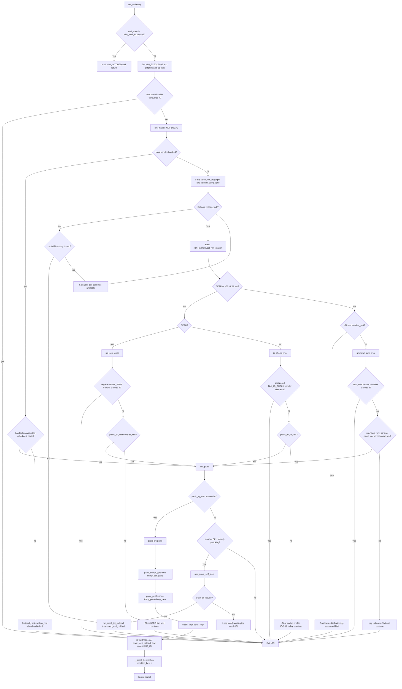
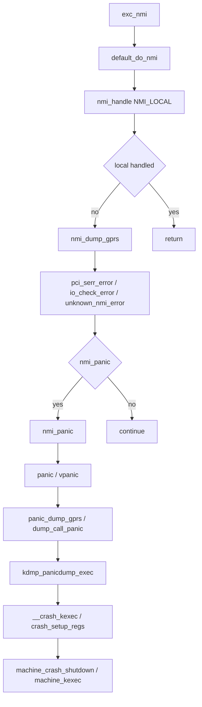
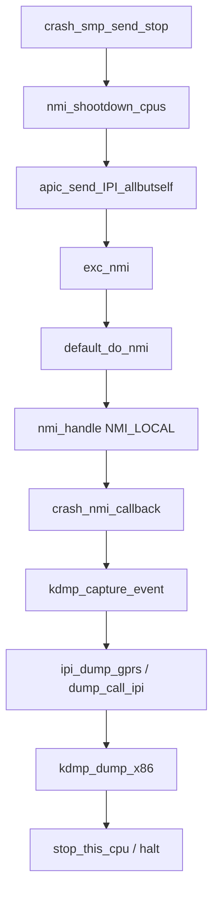

# linux-yocto_kdump_ko における NMI 発生後のフロー

この文書は、`linux-yocto_kdump_ko` で NMI が発生した後、どの条件でどの経路に分岐し、最終的に panic/kdump に至るかを整理したものです。

対象の主なコードは次のとおりです。

- `arch/x86/kernel/nmi.c`
- `kernel/watchdog.c`
- `kernel/panic.c`
- `arch/x86/kernel/reboot.c`
- `arch/x86/kdmp/kdmp_setup.c`
- `arch/x86/kdmp/kdmp_dump.c`

## 前提: kdmp フックはどこで差し込まれるか

`kdmp_initialize()` で次のフックが設定されます。

- `panic_dump_gprs = dump_call_panic`
- `nmi_dump_gprs = dump_call_nmi`
- `ipi_dump_gprs = dump_call_ipi`
- `panic_notifier_list` に `kdmp_panic_notifier` を登録

つまり、NMI 中に `nmi_dump_gprs()` が呼ばれれば `KDMP_NMI` スロットに、panic 中に `panic_dump_gprs()` が呼ばれれば `KDMP_PANIC` スロットに、他 CPU 停止用 crash NMI 中に `ipi_dump_gprs()` が呼ばれれば `KDMP_IPI` スロットに保存されます。

## フローチャート

## 分岐条件の詳細理由

### 1. `exc_nmi` で `nmi_state != NMI_NOT_RUNNING` の場合

理由:

- x86 NMI は再入可能に見えても、実際には「今 NMI 実行中か」「後続 NMI がラッチされたか」を明示管理しないと文脈が壊れます。
- すでに NMI 実行中の CPU でさらに NMI が来た場合、その場で二重実行せず `NMI_LATCHED` にして外側の NMI 終了後に `nmi_restart` へ戻します。
- これはコメントにもある通り、`iret` によって NMI が再入し得るためです。

補足:

- ここでいう `nmi_restart` は「C 関数を再帰呼び出しする」のではなく、`exc_nmi()` 内のローカルラベルです。
- 最初の NMI で `nmi_state = NMI_EXECUTING` にして `default_do_nmi()` を実行します。
- その実行中に別の NMI が来ると、内側の `exc_nmi()` は処理本体に入らず `nmi_state = NMI_LATCHED` を立てて即 return します。
- 外側の NMI が最後まで終わると、末尾の `this_cpu_dec_return(nmi_state)` が実行されます。
- 状態が `NMI_LATCHED` なら `dec_return` の結果が 0 にならず、コードは `goto nmi_restart;` で同じ `exc_nmi()` の先頭寄りへ戻り、ラッチされていた 1 回分の NMI を改めて処理します。
- つまり、これは「再入防止しつつ、失われていない 1 回分の後続 NMI を外側の処理完了後にやり直す」仕組みです。
- ただしラッチは 1bit 相当なので、NMI が 2 回以上重なると全部は保持できません。コメントにもある通り、再開できるのは最大 1 件だけです。

### 2. `microcode_nmi_handler()` が真なら即 return する理由

理由:

- マイクロコード更新や CPU 固有の保守処理が NMI を専有するケースがあるためです。
- この場合、その NMI はすでに目的別に処理済みであり、以降の通常 NMI 分類に流すと誤分類になります。

まず microcode とは何か:

- x86 CPU の命令実行や例外処理の一部は、ハードウェア回路だけでなく CPU 内部の低レベル制御コードでも実現されています。この CPU 内部の制御コード更新が microcode update です。
- OS から見ると、これは「CPU の内部動作の不具合修正や挙動調整を行うための、ベンダ配布ファームウェアに近い更新」です。
- Linux は起動時の early loading だけでなく、条件によっては稼働後に late loading もできます。
- late loading では、複数 CPU や SMT sibling が同時に不整合な状態へ入らないよう、全 CPU をかなり厳密に同期させる必要があります。

具体例:

- `microcode_nmi_handler()` は late microcode loading の NMI rendezvous 用です。
- `arch/x86/kernel/cpu/microcode/core.c` では、`load_late_stop_cpus()` が `microcode_nmi_handler_enable` を有効化し、各 CPU に NMI を打って、microcode 更新中の sibling/secondary CPU を安全な待機点へ集めます。
- `microcode_nmi_handler()` 自体は `ucode_ctrl.nmi_enabled` を見て、対象 CPU なら `microcode_update_handler()` を実行して `load_primary()` または `load_secondary()` 側へ入れます。
- soft-offlined CPU 向けには `microcode_offline_nmi_handler()` もあり、こちらも NMI で rendezvous に参加させます。

もう少し具体的にいうと:

- 1 つの CPU が primary となって microcode をロードしている間、同じ core の sibling thread や他 CPU が中途半端な状態で走ると危険です。
- そのため Linux は NMI を使って各 CPU を「今この地点で止まれ」という rendezvous 点へ連れていきます。
- `microcode_nmi_handler()` が true を返すときは、その NMI が perf/watchdog/unknown 用ではなく、「今まさに microcode 更新用の同期に使われている」ことを意味します。
- この文脈では NMI 自体が更新プロトコルの一部なので、generic な NMI 分類へ回すべきではありません。

「最優先か」について:

- `default_do_nmi()` の中では実際に最優先です。`microcode_nmi_handler_enabled() && microcode_nmi_handler()` の判定が `NMI_LOCAL` より前にあります。
- 理由は、late microcode update 中は「NMI で CPU を安全に足並みさせる」こと自体が目的だからです。
- ここで perf/watchdog/unknown 判定へ流すと、microcode 更新中の CPU 同期が崩れます。
- ただし常時有効ではありません。`CONFIG_MICROCODE_LATE_LOADING` があり、かつ更新のその瞬間だけ static key が有効になります。通常運用時に毎回 microcode が NMI を横取りするわけではありません。

### 3. `NMI_LOCAL` を最初に処理する理由

理由:

- `default_do_nmi()` のコメントどおり、CPU 固有の NMI はその CPU でしか意味を持たず、他 CPU が代わりに処理できません。
- 先に外部要因の `SERR/IOCHK/UNKNOWN` 判定をすると、local APIC/perf/watchdog 系のイベントを取り逃がす可能性があります。

詳しく言うと:

- `NMI_LOCAL` には、代表例として `perf_event_nmi_handler()` の PMI、hardlockup watchdog、NMI backtrace、kgdb などが登録されます。
- 例えば perf の PMI は `arch/x86/events/core.c` で `register_nmi_handler(NMI_LOCAL, perf_event_nmi_handler, 0, "PMI")` され、NMI コンテキストで PMU overflow を回収します。
- watchdog も `kernel/watchdog_perf.c` で perf event callback から `watchdog_hardlockup_check()` を呼び、必要なら `nmi_panic()` に進みます。つまり watchdog hardlockup も実質的には local PMI/NMI の上に乗っています。
- これらは「その CPU の PMU カウンタが overflow した」「その CPU の watchdog 監視対象が止まった」という CPU ローカル事象です。

local で処理するものをもう少し分解すると:

- `PMI(performance monitoring interrupt)`
    PMU カウンタ overflow による NMI です。perf sampling や watchdog の基盤として使われます。overflow した PMU はその CPU に属しているので、基本的にその CPU の handler が直ちに回収する必要があります。
- `hardlockup watchdog`
    perf ベースの PMU overflow を利用して「その CPU が timer interrupt を進めているか」を監視します。異常があればその CPU の NMI 文脈で `watchdog_hardlockup_check()` が実行されます。
- `NMI backtrace`
    他 CPU のスタックを強制的に出させるための NMI です。`arch/x86/kernel/apic/hw_nmi.c` で `arch_bt` handler として `NMI_LOCAL` 登録されています。
- `kgdb`
    デバッガ侵入用の NMI handler です。`arch/x86/kernel/kgdb.c` で `NMI_LOCAL` と `NMI_UNKNOWN` の両方に登録されますが、CPU ローカルなデバッグ割り込みとして処理したいケースがあります。
- `uv ping` のような platform 固有 local NMI
    `arch/x86/platform/uv/uv_nmi.c` では `uvping` が `NMI_LOCAL` に登録されます。
- `smp_stop_nmi_callback` のような CPU 停止用 local NMI
    停止要求自体は system-wide でも、受信と停止処理は各 CPU ローカルに行います。

共通点:

- これらは「どの CPU が受けたか」が意味そのものの一部です。
- 外部配線の `SERR/IOCHK` のように「どの CPU が代表して読んでもよい」タイプではありません。
- そのため、先に `NMI_LOCAL` を総当たりして「この CPU 自身に属する NMI か」を最初に判定する必要があります。

なぜ先に処理しないと取り逃がすのか:

- `x86_platform.get_nmi_reason()` で読める `SERR/IOCHK` は、主に外部配線やチップセット理由の分類です。PMI や perf overflow が reason port に出るわけではありません。
- したがって local PMI が来ているのに先に reason port を見ても、多くの場合 `reason == 0` になります。
- その状態で `unknown_nmi_error()` 側へ進むと、「本当は perf/watchdog が処理すべき NMI」を unknown と誤認してしまいます。
- さらに NMI は edge-triggered なので、1 回の NMI を取り違えて generic 側で消費すると、その CPU ローカルイベントを後で別 CPU が取り戻すことはできません。
- コメントの「because the CPU-specific NMI can not be detected/processed on other CPUs.」はこの意味です。local な NMI は、その CPU がその場で handler を走らせる以外に救済手段がありません。

### 4. `NMI_LOCAL` が handled した場合に generic 側へ進まない理由

理由:

- local handler が責任を持ってその NMI を消費したとみなすためです。
- 特に hard lockup watchdog は `kernel/watchdog.c` から `nmi_panic(regs, "Hard LOCKUP")` を直接呼びます。
- この経路は `default_do_nmi()` 内の `kdmp_nmi_regs[cpu] = regs` より前で panic に入るため、watchdog 起因の panic では `KDMP_NMI` よりも `KDMP_PANIC` 側の採取が主になります。

補足:

- 既存メモの通り、`unknown_nmi`/`SERR`/`IOCHK` 経路では `kdmp_nmi_regs[]` が先にセットされますが、watchdog hard lockup は例外です。

### 5. `handled > 1` で `swallow_nmi` を立てる理由

理由:

- NMI は edge-triggered で、複数イベントが近接すると 1 回分しかラッチされません。
- ある 1 回の NMI で複数イベントをまとめて処理した場合、次の NMI が見かけ上 `unknown` になることがあります。
- その誤判定を避けるため、「直前に複数イベントを処理した」という印を `swallow_nmi` に残します。

補足:

- この理解で合っています。`swallow_nmi` は「local 側で 1 回の NMI 中に複数イベントを処理した可能性がある」ことを次回判定のために覚えておくフラグです。
- 実際、`nmi_handle(NMI_LOCAL, regs)` の戻り値 `handled` は「何個の NMI event を handler 群が処理したか」の合計です。
- `handled > 1` のとき、コードは「今回すでに 2 件以上まとめて処理した。次に来る NMI は新規 unknown ではなく、前回まとめて処理した残りの見かけ上の再通知かもしれない」と考えます。
- その記憶を `__this_cpu_write(swallow_nmi, true)` に保存し、次回 NMI が back-to-back 条件も満たしたときだけ unknown を飲み込みます。
- 逆に、別 RIP から来た NMI なら新しい実行文脈に戻ったとみなし、冒頭で `swallow_nmi` は false にリセットされます。

### 6. local handler が何も処理しなかったときに `kdmp_nmi_regs[cpu] = regs` を行う理由

理由:

- ここから先は external/unknown 系の generic NMI 解釈に入るため、この時点の NMI 文脈を `KDMP_NMI` として保存したいからです。
- その後に `nmi_panic()` へ進んでも、少なくとも generic NMI として入った事実とその `pt_regs` は `kdmp_nmi_regs[]` に残ります。

### 7. `nmi_reason_lock` を取れないときに `run_crash_ipi_callback()` を優先する理由

理由:

- 別 CPU がすでに panic/crash dump 準備中で `nmi_reason_lock` を持っている可能性があるためです。
- この状態でただ待つと、その CPU が送った crash NMI による CPU 停止処理を取り逃がします。
- そのため `crash_ipi_issued` が見えていれば、即 `crash_nmi_callback()` に入り、自 CPU を crash 停止側へ移します。

### 8. `reason & NMI_REASON_MASK` で `SERR/IOCHK` を優先判定する理由

理由:

- x86 の NMI reason port から、少なくとも外部配線由来のエラー種別は取得できるためです。
- `SERR` と `IOCHK` は「unknown」に落とす前に個別扱いでき、ログ内容もクリア動作も異なります。

### 9. `pci_serr_error()` がまず `nmi_handle(NMI_SERR, regs)` を試す理由

理由:

- プラットフォーム固有やドライバ固有の SERR handler があれば、それが最も正確に原因を説明できるためです。
- 誰も引き取らなかった場合のみ、汎用の「PCI system error」として扱います。

その後の分岐理由:

- `panic_on_unrecovered_nmi=1` なら、回復不能 NMI を継続実行させるほうが危険なので `nmi_panic()` します。
- そうでなければ SERR line を clear して継続します。これは同じ外部線で NMI が張り付き続けるのを防ぐためです。

### 10. `io_check_error()` が `panic_on_io_nmi` で分岐する理由

理由:

- IOCHK は本当に致命的な I/O 異常か、古いデバッグ用途の NMI かをコードだけで確定しにくいためです。
- そのため、即 panic するかどうかを運用ポリシーの `panic_on_io_nmi` に委ねています。
- panic しない場合は IOCHK line をいったん clear し、少し待って再度有効化します。NMI 線が連続発火してシステムが前進できなくなるのを避けるためです。

### 11. `reason` が 0 の場合に `unknown_nmi_error()` へ行く理由

理由:

- local handler も処理せず、NMI reason port にも外部エラー種別が出ていないため、「誰の責任か確定できない NMI」だからです。
- ただし本当に unknown とは限らず、edge-trigger の都合で前回処理済みイベントの残像である可能性があります。

### 12. `b2b && swallow_nmi` なら unknown を飲み込む理由

まず結論:

- このロジックは、「本当は前回の local NMI で処理済みなのに、次の NMI で unknown に見えてしまう」誤判定を減らすためのものです。
- つまり 12 は「unknown NMI を正しく検出する仕組み」ではなく、「偽の unknown NMI をなるべく増やさない仕組み」です。

最も単純に言うと:

- 前回の NMI で local handler が複数イベントをまとめて処理した。
- その直後に、ほぼ連続でもう 1 回 NMI が来た。
- 今回は local handler も reason port も何も説明してくれない。
- それなら「これは新しい unknown NMI ではなく、前回まとめて処理したイベントの後追いかもしれない」とみなして捨てる。

この判断に使うのが `b2b && swallow_nmi` です。

`back-to-back` とは:

- `default_do_nmi()` では `regs->ip == last_nmi_rip` なら `b2b = true` にしています。
- これは「前回の NMI と今回の NMI で RIP が同じだった」という意味です。
- カーネルのコメントどおり、この条件は「CPU が前回 NMI から通常文脈へ戻って命令実行を再開する暇がなかった」ことの近似判定です。
- つまり back-to-back NMI とは、前の NMI が終わるか終わらないかのタイミングで、ほぼ連続して次の NMI が来た状態を指します。

ここで重要なのは、「前回と同じ NMI が飛んできた」と厳密に証明しているわけではないことです。

- `b2b` が示しているのは、あくまで「前回と今回の NMI の間に通常文脈へ戻っていない可能性が高い」という状況証拠です。
- `swallow_nmi` が示しているのは、「前回の local handler 群が 1 回の NMI で複数イベントを処理した」という状況証拠です。
- この 2 つを組み合わせて初めて、「今回の unknown は、新しい unknown NMI ではなく、前回まとめて処理した local event の取りこぼし再通知かもしれない」と推定しています。
- つまりこれは厳密一致判定ではなく、edge-triggered NMI の制約下で unknown の誤爆を減らすためのヒューリスティックです。

なぜ `b2b` だけでは足りないか:

- 連続して NMI が来ただけなら、本当に新しい unknown NMI かもしれません。
- そのため `b2b` だけで unknown を捨てるのは危険です。

なぜ `swallow_nmi` だけでも足りないか:

- 前回複数イベントを処理したとしても、今回の NMI がかなり後になってから来たなら、それは新しい unknown NMI かもしれません。
- そのため `swallow_nmi` だけで unknown を捨てるのも危険です。

2 条件がそろうと何が言えるか:

- 直前の NMI で local 側が複数イベントを回収している。
- しかも今回は通常文脈へ戻る前に、ほぼ連続で次の NMI が来ている。
- なら今回の unknown は、「前回まとめて処理した local event の見かけ上の残り」である可能性が高い。
- このときだけ unknown を swallow します。

なぜこれが `swallow_nmi` と組み合わされるのか:

- `swallow_nmi` だけでは、「前回たまたま複数イベントを処理した」以上のことは分かりません。
- `b2b` だけでも、「たまたま同じ RIP で別の本物 unknown NMI が来た」可能性を否定できません。
- 2 つが同時に立つと、初めて「前回の local handler が複数件さばいた直後に、ほぼ連続の NMI が来た。これは前回まとめて処理した分の見かけ上の残りではないか」という推定が成り立ちます。
- そのため unknown を即 panic 扱いせず、`nmi_stats.swallow` を増やして捨てる設計になっています。

成立理由を時系列で書くと:

1. ある CPU で local NMI handler 群が走る。
2. その 1 回の NMI で `handled > 1` になり、`swallow_nmi = true` になる。
3. 直後にもう 1 回 NMI が来る。
4. 今回の RIP が前回と同じで `b2b = true` になる。
5. しかし reason port には `SERR/IOCHK` がなく、local handler も今回は何も claim しない。
6. ここで unknown と断定する代わりに、「前回まとめて回収した local event の名残かもしれない」とみなして swallow する。

イメージ:

- 1 回目の NMIで perf/PMI 系のイベント A と B をまとめて処理した。
- しかし NMI は edge-triggered なので、ハードウェア的にはもう 1 回 NMI が来ても不思議ではない。
- 2 回目の NMI では、A と B はすでに処理済みなので local handler は何も claim しない。
- その結果だけ見ると unknown NMI に見える。
- そこで `handled > 1` の記憶と back-to-back の状況から、「これは新しい unknown ではなく、前回の処理済みイベントの後追いだろう」と判断して捨てる。

何がクリアされるのか:

- `swallow_nmi` はカウンタではなく per-CPU の boolean フラグです。
- クリア条件の主経路は `default_do_nmi()` 冒頭で、`regs->ip != last_nmi_rip` のとき `__this_cpu_write(swallow_nmi, false)` が実行されることです。
- つまり「前回と違う RIP から NMI が入った」時点で、前回の複数処理の記憶は捨てます。
- `last_nmi_rip` 自体は毎回 `__this_cpu_write(last_nmi_rip, regs->ip)` で更新されます。
- さらに明示的なリセット手段として `local_touch_nmi()` もあり、これは `last_nmi_rip = 0` にして back-to-back 判定をリセットします。

注意:

- `nmi_stats.swallow` は統計カウンタで、swallow が何回起きたかを数えるだけです。判定に使う状態そのものではありません。
- 判定に使う実際の状態は `swallow_nmi` フラグと `last_nmi_rip` です。

注意点:

- ソースコメントにもある通り、このロジックは完全ではありません。
- 例えば perf NMI と本物 unknown NMI が重なった場合、本物 unknown まで飲み込んでしまう可能性があります。
- それでも edge-triggered NMI の制約下では、誤って unknown を量産するよりは現実的な折衷という位置づけです。

### 13. `unknown_nmi_error()` が `NMI_UNKNOWN` handler を最後に試す理由

理由:

- 原因ポートだけでは判別できない NMI を、ベンダ固有・ハイパーバイザ固有の handler が救済できることがあるためです。
- 実際に誰かが claim したなら、その handler が最も妥当な所有者なので unknown panic にはしません。

その後の panic 分岐理由:

- `unknown_nmi_panic=1` は boot param で「unknown NMI は継続させない」方針です。
- `panic_on_unrecovered_nmi=1` は「回収できなかった NMI は一律 panic」方針です。
- いずれも立っていなければ、未知だが一旦継続可能とみなします。

### 14. `nmi_panic()` で `panic_try_start()` を使う理由

理由:

- panic パスは 1 CPU だけが主導しないと、複数 CPU が同時に `panic()` と `__crash_kexec()` を実行してクラッシュダンプ自体を壊すためです。
- 先着 CPU だけが panic owner になり、残りは停止側に回ります。

### 15. `panic_on_other_cpu()` なら `nmi_panic_self_stop()` に入る理由

理由:

- すでに別 CPU が panic owner になっているなら、この CPU が独自に panic 処理を進めるべきではないためです。
- NMI 文脈では通常のスケジューリング停止に頼れないので、`nmi_panic_self_stop()` が busy loop しながら `crash_ipi_issued` を監視します。
- crash IPI が来たら `run_crash_ipi_callback()` 経由で `crash_nmi_callback()` に合流します。

## panic 以降に kdmp に何が保存されるか

### panic owner CPU

`vpanic()` 冒頭で `panic_dump_gprs()` が呼ばれ、`dump_call_panic()` から次が実行されます。

- `kdmp_live_capture(..., KDMP_EVENT_PANIC, ...)`
- `kdmp_dump_gprs(KDMP_PANIC)`
- `kdmp_dump_x86(KDMP_PANIC)`

その後、panic notifier で `kdmp_panicdump_exec()` が呼ばれ、PCI/IO レジスタと printk tail が保存されます。

### 他 CPU

`crash_smp_send_stop()` により crash NMI が送られ、各 CPU は `crash_nmi_callback()` に入ります。

そこで次が実行されます。

- `kdmp_ipi_regs[cpu] = regs`
- `kdmp_capture_event(..., KDMP_EVENT_IPI, ...)`
- `ipi_dump_gprs()`

結果として `KDMP_IPI` スロットに各 CPU の停止時レジスタが保存されます。

## `KDMP_NMI` と `KDMP_PANIC` の使い分けで重要な点

### generic external/unknown NMI

- `kdmp_nmi_regs[cpu]` が `default_do_nmi()` 内で先にセットされる
- `nmi_dump_gprs()` もその場で呼ばれる
- よって `KDMP_NMI` スロットが埋まる

### watchdog hard lockup NMI

- `NMI_LOCAL` handler の段階で `nmi_panic()` へ進む
- `kdmp_nmi_regs[cpu]` セット前に panic する
- よって `KDMP_NMI` より `KDMP_PANIC` が主になる

これは `dump_check_call_status()` の挙動にも関係します。

- `KDMP_PANIC` 実行時に `kdmp_nmi_regs[cpu] != NULL` なら panic スロット保存は抑止される
- 逆に watchdog 経路のように `kdmp_nmi_regs[cpu] == NULL` のまま panic に入ると、`KDMP_PANIC` 保存が有効になる

## まとめ

`linux-yocto_kdump_ko` の NMI フローは、まず `NMI_LOCAL` を最優先で処理し、その結果によって大きく 2 本に分かれます。

1. watchdog など local NMI handler が処理する経路
2. SERR/IOCHK/UNKNOWN として generic に解釈する経路

kdmp 観点で最も重要なのは次の差です。

- watchdog hard lockup は `KDMP_NMI` 採取前に `nmi_panic()` へ飛びやすい
- unknown/SERR/IOCHK は `KDMP_NMI` を保存してから panic/continue を判断する

そのため、同じ「NMI 起因の kdump」に見えても、どの枝を通ったかで `kdmp_nmi_regs[]` の有無と `KDMP_PANIC/KDMP_NMI/KDMP_IPI` の埋まり方が変わります。

## 関数コールツリー粒度のフローと `pt_regs` の可視性

ここでは NMI 起点の代表的な流れを、関数レベルで約 10 段に落として整理します。

### A. generic NMI から panic/kdump に至る代表フロー

1. `exc_nmi(regs)`
    NMI の x86 入口です。ここではハードウェアから渡された `struct pt_regs *regs` がそのまま使えます。

2. `default_do_nmi(regs)`
    NMI の大分類を行う本体です。ここでも `regs` はそのまま引き回されています。

3. `nmi_handle(NMI_LOCAL, regs)`
    CPU ローカル handler 群を順に呼びます。各 local handler は同じ `regs` を受け取れます。

4. `kdmp_nmi_regs[cpu] = regs` と `nmi_dump_gprs()`
    local が未処理だった場合、generic NMI として `regs` ポインタを保存します。この時点で `pt_regs` は「直接引数」ではなく「保存済みポインタ」として後段から参照可能になります。

5. `pci_serr_error(reason, regs)` / `io_check_error(reason, regs)` / `unknown_nmi_error(reason, regs)`
    external/unknown 分類後の分岐先です。ここではまだ `regs` がそのまま引数で渡っています。

6. `nmi_panic(regs, msg)`
    panic に進む場合の NMI 専用入口です。NMI 起因で panic する枝では、この関数まで `pt_regs` を直接保持しています。

7. `panic()` / `vpanic()`
    ここでは関数引数としての `pt_regs` はなくなります。`vpanic()` は文字列ベースの panic 本体です。

8. `panic_dump_gprs()` -> `dump_call_panic()`
    `pt_regs` は直接渡されません。代わりに `kdmp_ecxt_regs[cpu]` が事前に保存されていれば、それを `dump_call_panic()` -> `kdmp_dump_x86(KDMP_PANIC)` が参照します。

9. `atomic_notifier_call_chain(&panic_notifier_list, ...)` -> `kdmp_panicdump_exec()`
    ここでも `pt_regs` は notifier 引数としては渡りません。CPU レジスタ類は前段での `KDMP_PANIC`/`KDMP_NMI`/`KDMP_IPI` 保存結果を使います。

10. `__crash_kexec(NULL)` -> `crash_setup_regs(&fixed_regs, NULL)`
     panic 経由では `__crash_kexec()` は通常 `NULL` で呼ばれるため、元の `pt_regs` は直接は来ません。x86 の `crash_setup_regs()` が現在のレジスタから `fixed_regs` を組み立てます。

11. `machine_crash_shutdown(&fixed_regs)` -> `machine_kexec(kexec_crash_image)`
     ここでは `fixed_regs` が使われ、元の NMI 時 `pt_regs` そのものではありません。

### B. 他 CPU 停止用 crash NMI 側のフロー

1. `crash_smp_send_stop()` / `nmi_shootdown_cpus()`
    panic owner CPU が他 CPU に crash NMI を送ります。この時点では他 CPU 側の `pt_regs` はまだありません。

2. `crash_nmi_callback(val, regs)`
    NMI を受けた他 CPU の停止ハンドラです。ここではその CPU の `pt_regs` が直接引数で渡ります。

3. `kdmp_ipi_regs[cpu] = regs`
    他 CPU 側 `pt_regs` を保存します。以降は保存済みポインタとして参照できます。

4. `ipi_dump_gprs()` -> `dump_call_ipi()`
    関数引数としての `pt_regs` はありませんが、`kdmp_ipi_regs[cpu]` 経由で参照可能です。

5. `kdmp_dump_x86(KDMP_IPI)`
    `dump_get_regs_addr(KDMP_IPI)` が `kdmp_ipi_regs[cpu]` を返し、例外文脈 `pt_regs` を間接参照できます。

### `pt_regs` が取得可能な位置のまとめ

`pt_regs` をそのまま直接使える位置:

- `exc_nmi(regs)`
- `default_do_nmi(regs)`
- `nmi_handle(..., regs)` とその配下 handler
- `pci_serr_error(..., regs)`
- `io_check_error(..., regs)`
- `unknown_nmi_error(..., regs)`
- `nmi_panic(regs, ...)`
- `crash_nmi_callback(..., regs)`
- `run_crash_ipi_callback(regs)`
- `nmi_panic_self_stop(regs)`

`pt_regs` を保存済みポインタ経由で取得できる位置:

- `dump_call_nmi()`
  `kdmp_nmi_regs[cpu]` 経由
- `dump_call_ipi()`
  `kdmp_ipi_regs[cpu]` 経由
- `dump_call_panic()`
  `kdmp_ecxt_regs[cpu]` 経由。ただし存在しない場合あり
- `kdmp_dump_x86(status)`
  `dump_get_regs_addr(status)` 経由

`元の NMI 時 pt_regs` は直接取れず、別のレジスタ像に置き換わる位置:

- `vpanic()`
  `pt_regs` 引数なし
- `kdmp_panicdump_exec()`
  PCI/IO/printk 保存が中心で、`pt_regs` は前段の保存結果に依存
- `__crash_kexec(NULL)`
  `pt_regs` は来ず、`crash_setup_regs()` が現在レジスタから `fixed_regs` を構成
- `machine_crash_shutdown(&fixed_regs)` 以降
  扱うのは `fixed_regs`

### 実務上の見方

- NMI を受けたその瞬間の `pt_regs` を最も素直に追えるのは `exc_nmi()` から `nmi_panic()` または `crash_nmi_callback()` までです。
- kdmp の保存処理では、その `pt_regs` を後で使えるよう `kdmp_nmi_regs[]` / `kdmp_ipi_regs[]` / `kdmp_ecxt_regs[]` に退避している、という理解で十分です。
- panic 本体まで入ると、関数引数としての `pt_regs` は消え、以降は「退避済み `pt_regs` を使う」か「現在レジスタから組み直した `fixed_regs` を使う」かのどちらかになります。